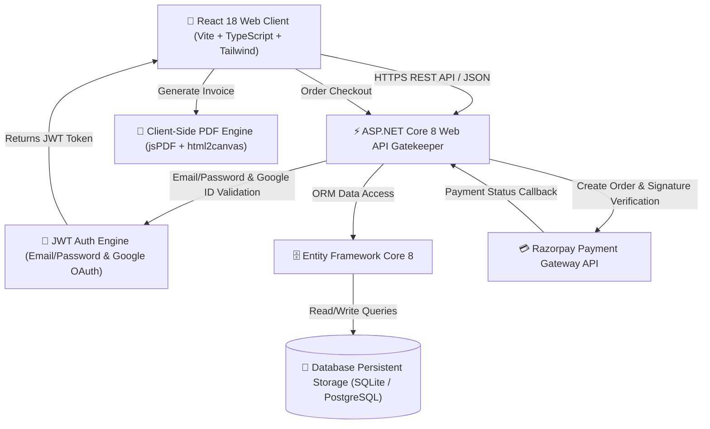
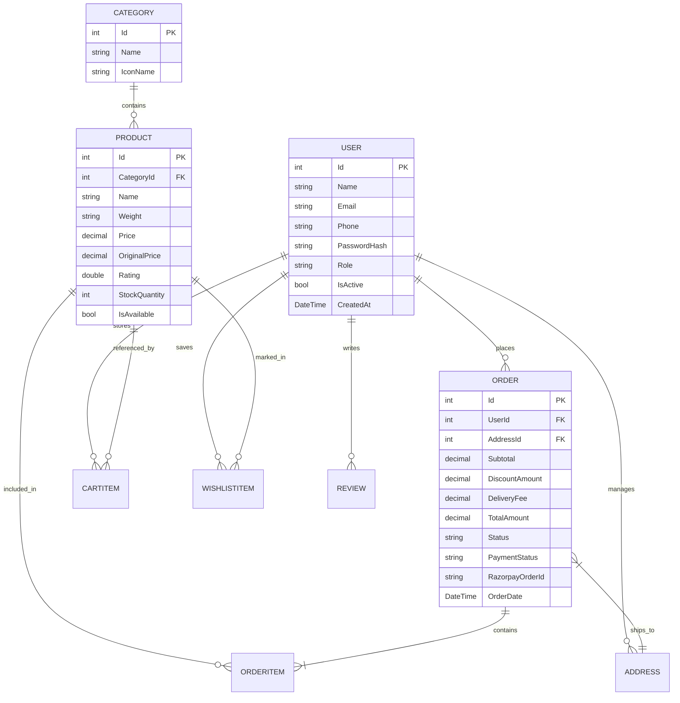

# 🛒 FreshCart — Enterprise Full-Stack Supermarket Platform

[](https://github.com/)
[](https://react.dev/)
[](https://dotnet.microsoft.com/)
[](https://www.sqlite.org/)
[](https://tailwindcss.com/)
[](https://www.docker.com/)
[](LICENSE)

An end-to-end, production-grade grocery e-commerce web application engineered with a high-performance **React 18 + Vite** client and a scalable **ASP.NET Core 8 Web API** backend. Designed with mobile-first UI paradigms, real-time cart state synchronization, secure Email/Password & Google OAuth authentication, automated coupon verification, and Razorpay payment integration.

---

## 📐 System Architecture



---

## ✨ Key Platform Features

| Module | Features & Capabilities |
| --- | --- |
| 🔐 **Authentication** | Secure Email/Password registration & login, Google OAuth integration, JWT bearer token authorization, persistent user sessions. |
| 🛍️ **Product Catalog** | Instant client-side & server-side search, category filter ribbons, sorting by price/rating, unit weight variations. |
| 🛒 **Cart & Sync** | Optimistic local cart management with seamless server sync upon user login; persistence across devices. |
| 🎟️ **Promotions & Discount Engine** | Flat discount and percentage calculation engine with validation (`SAVE50`, `FLAT100`, `FIRST20`, `SAISALE`). |
| 📍 **Address Book** | Multi-address management (Home, Work, Other) with default address tagging for fast checkout. |
| ❤️ **Wishlist** | One-click item saved states for quick reordering. |
| 💳 **Payments & Checkout** | Integrated Razorpay checkout flow with backend SHA-256 signature verification and order confirmation. |
| 📄 **Invoice Engine** | Instant client-side printable order receipts and PDF invoice generation via `jsPDF` and `html2canvas`. |
| 🐳 **DevOps & Containers** | Multi-stage Dockerized containers managed with standard `docker-compose`. |

---

## 🧰 Technology Matrix

### Frontend Stack (`/frontend`)
- **Core Library**: React 18, TypeScript 5, Vite 6
- **Routing**: React Router 7
- **Styling**: Tailwind CSS v4, Radix UI Primitives, Lucide Icons
- **Animation & FX**: Framer Motion (`motion`), `canvas-confetti`
- **State & Utils**: Custom React Context Hooks, `date-fns`, `clsx`, `tailwind-merge`
- **Document Generation**: `jspdf`, `html2canvas`

### Backend Stack (`/backend`)
- **Framework**: .NET 8 SDK (ASP.NET Core Web API)
- **Persistence Layer**: Entity Framework Core 8, SQLite / PostgreSQL
- **Security & Authorization**: `Microsoft.AspNetCore.Authentication.JwtBearer`, System.IdentityModel.Tokens.Jwt, PBKDF2 Password Hashing
- **Payment Processing**: Razorpay SDK (`Razorpay.Api`)
- **API Spec**: OpenAPI Specification / Swagger UI

---

## 📊 Database Schema (Entity-Relationship Diagram)



---

## 🚀 Quick Start Guide

### Prerequisites
- **Node.js**: v18.0.0 or higher ([Download](https://nodejs.org/))
- **.NET SDK**: v8.0 or higher ([Download](https://dotnet.microsoft.com/download/dotnet/8.0))
- **Docker Desktop**: (Optional, for containerized execution)

---

### Option A: Running with Docker Compose (Recommended)

Spins up containerized instances of the API backend and the React frontend:

```bash
# Clone the repository
git clone https://github.com/your-org/supermarket-app.git
cd supermarket-app

# Build and launch all services
docker-compose up --build
```

Access services at:
- 🌐 **Web Client**: `http://localhost:3000`
- ⚙️ **Backend API**: `http://localhost:5000`
- 📄 **Interactive OpenAPI Docs**: `http://localhost:5000/swagger`

---

### Option B: Local Developer Workflows

#### 1. Start the Backend Web API

```bash
cd backend/SuperMarketAPI

# Restore dependencies
dotnet restore

# Apply database migrations
dotnet ef database update

# Launch API server
dotnet run
```
*Backend API service starts at `http://localhost:5000`.*

#### 2. Start the Frontend Vite Server

Open a new terminal window:

```bash
cd frontend

# Install node dependencies
npm install

# Start Vite dev server
npm run dev
```
*Frontend dev client launches at `http://localhost:5173`.*

---

## ⚙️ Environment Configuration

### Frontend Environment (`/frontend/.env.development`)
```env
VITE_API_URL=http://localhost:5000/api
```

### Backend Configuration (`/backend/SuperMarketAPI/appsettings.json`)
```json
{
  "ConnectionStrings": {
    "DefaultConnection": "Data Source=supermarket.db"
  },
  "Jwt": {
    "Key": "SuperMarketAppSecretKeyForJWTAuth2026!",
    "Issuer": "SuperMarketAPI",
    "Audience": "SuperMarketApp"
  },
  "Razorpay": {
    "KeyId": "rzp_test_YOUR_KEY_ID",
    "KeySecret": "YOUR_KEY_SECRET"
  },
  "Cors": {
    "AllowedOrigins": [
      "http://localhost:5173",
      "http://localhost:3000"
    ]
  }
}
```

---

## 🧪 Testing & Demo Credentials

### User Authentication Credentials
- **Demo Customer Email**: `user@example.com` / **Password**: `password123`
- **Demo Admin Email**: `admin@example.com` / **Password**: `admin123`
- **Google Sign-In**: Supported via Google OAuth frontend button.

### Pre-Configured Promotional Coupons
| Code | Discount Type | Threshold | Details |
| --- | --- | --- | --- |
| `SAVE50` | Flat Off | Min ₹299 | Instant ₹50 reduction |
| `FLAT100` | Flat Off | Min ₹599 | Instant ₹100 reduction |
| `FIRST20` | Percentage | Min ₹199 | 20% discount (Capped at ₹150) |
| `SAISALE` | Percentage | Min ₹499 | 15% discount (Capped at ₹200) |

---

## 📁 Repository Directory Structure

```
SuperMarket APP/
├── .agents/                    # Agent & workspace customizations
├── scripts/                    # Automation scripts for asset generation & image fetching
│   └── fetch_product_images.py # Python image scraping utility
├── backend/
│   ├── Dockerfile              # Container definition for ASP.NET API
│   └── SuperMarketAPI/
│       ├── Controllers/        # Auth, Cart, Orders, Products, Payments, Wishlist
│       ├── Data/               # AppDbContext & initial database seeder
│       ├── DTOs/               # Data Transfer Objects
│       ├── Models/             # Domain entities (User, Product, Order, etc.)
│       ├── Services/           # Payment gateway & domain logic
│       └── appsettings.json    # Application configuration
├── frontend/
│   ├── Dockerfile              # Container definition for Vite app
│   ├── public/                 # Static public resources & assets
│   └── src/
│       ├── app/
│       │   ├── components/     # Reusable UI component library
│       │   ├── context/        # React context providers (Auth, Cart, Wishlist)
│       │   ├── data/           # Fallback datasets
│       │   └── screens/        # Primary application screen views
│       └── lib/
│           ├── api.ts          # Typed REST API client
│           └── utils.ts        # Helper utilities & coupon calculation rules
├── docker-compose.yml          # Multi-container orchestration specification
└── README.md                   # Root workspace documentation
```

---

## 🔒 Security & Best Practices

1. **JWT Authentication**: Secured endpoints enforce `Bearer` token verification with expiration checks.
2. **Password Security**: Passwords are securely hashed using PBKDF2 with salt prior to storage.
3. **Payment Integrity**: Razorpay payment responses verify HMAC-SHA256 signatures before updating order status to `Paid`.
4. **CORS Enforcement**: Cross-Origin Resource Sharing is strictly constrained to authorized client origin domains.
5. **Environment Isolation**: Production secrets (JWT secret keys, Razorpay Key Secrets) should be loaded via system environment variables or cloud secrets managers.

---

## 📄 License & Attributions

This repository is distributed under the **MIT License**.

UI and visual components were inspired by the open [E-commerce Grocery App UI Kit](https://www.figma.com/design/eTVzSbEYlxA8jbUVuCHU5L/E-commerce-Grocery-App-UI-Kit).
